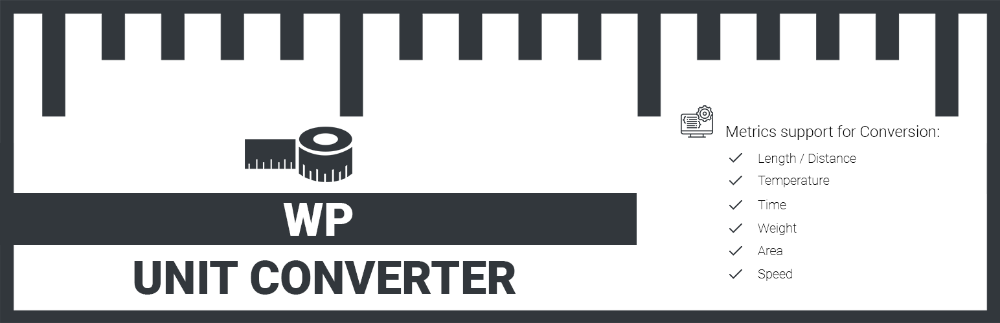



# WP Unit Converter

WP Unit Converter allows you to convert Length/Distance, Temperature, Time, Weight, Area and Speed metrics in different units of measurement.

## Features

WP Unit Converter offers conversion in the following metrics;

 - Length/Distance.
 - Temperature.
 - Time.
 - Weight.
 - Area.
 - Speed.
 
## Automatic installation

Automatic installation is the easiest option as WordPress handles the file transfers itself and you don't need to leave your web browser. To do an automatic install of this plugin, log in to your WordPress dashboard, navigate to the Plugins menu and click Add New.

In the search field type "WP Unit Converter" and click Search Plugins. Once you've found this plugin, you can install it by simply clicking "Install Now".

## Manual installation

1.	Download and unzip the WP Unit Converter plugin
2.	Upload the entire wp-unit-converter/ directory to the /wp-content/plugins/ directory
3.	Activate the WP Unit Converter plugin through the Plugins menu in WordPress

## How to use WP Unit Converter?
You can use WP Unit Converter in either Post/Pages or in Widget area.

### Use in Post/Pages
Simply copy the following shortcode and paste it into your desired location.
`[wpuc_unit_converter]`

### Use in Widget
WP Unit Converter, creates a Widget Calculator under Available Widgets Area in Widgets Menu, which you can drag & drop to your desired sidebar location.

## License
WP Unit Converter is distributed under the terms of GNU GPL2.

## Changelog

### 1.0.0
* Initial release

